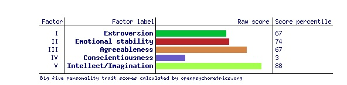

# Personality Clustering, Modeling, and Analysis

**Julian Benitez Mages & Anaelle Surprise**




## Data Setup

To set up your environment to run our model, follow these steps:

1. Clone the repository:
   ```
   git clone <repository_url>
   cd <repository_name>
   ```
2. Install dependencies:
   ```
   pip install -r requirements.txt
   ```
3. Run data processing:
   - The script processes the dataset, normalizes it, calculates trait scores, and handles missing values.
   - It also includes time tracking to monitor processing duration.

   ```bash
   python data_preprocessing.py
   ```

---

## Background & Context

The **Big Five Personality Traits** (also known as the **Five Factor Model**) is a framework for understanding personality based on five traits:
- **Openness**
- **Conscientiousness**
- **Extraversion**
- **Agreeableness**
- **Neuroticism**

The **IPIP** (International Personality Item Pool) inventory measures these traits through a set of 50 questions, with each rated on a scale from 1 to 5. Our dataset contains **1,015,342 responses** collected between 2016 and 2018, with additional metadata such as respondent country, screen size, and time spent on each survey page.

---

## Objective & Research Questions

### Key Question: **Do distinct personality clusters exist within the Big Five framework?**
While the Big Five model suggests personality traits lie on a continuous spectrum, clustering techniques can reveal whether there are natural groupings within the dataset.

### Additional Goals:
1. **Clustering Personality Traits:** Investigate if distinct personality profiles emerge through clustering.
2. **Survey Response Modeling:** Analyze how response times and patterns correlate with personality traits and demographic data.
3. **Geographic Location Prediction:** Use supervised learning to predict respondents' countries based on personality and response behavior.
4. **LLM Interpretation:** Employ large language models to interpret and describe personality clusters.

---

## Data Pre-Processing

Our data preprocessing pipeline includes:
- **Data Cleaning:** Removing duplicate responses based on IP addresses.
- **Normalization:** Converting responses to numerical values and calculating trait scores.
- **Handling Missing Values:** Removing rows with NaN values in survey responses.
- **Feature Engineering:** Adding calculated trait scores and response time features.

---

## Exploratory Data Analysis (EDA)

Key analyses conducted during EDA:
- **Trait Distribution:** Visualized the distribution of trait scores across the dataset.
- **Correlation Analysis:** Generated heatmaps of question-level response correlations.
- **Geographic Distribution:** Mapped the number of respondents per country.
- **Clustering Exploration:** Applied PCA and t-SNE for dimensionality reduction and initial clustering analysis.

---

## Clustering Insights

Clustering techniques were tested to determine if distinct personality types exist within the Big Five traits. While MBTI assumes discrete categories, the Big Five suggests a continuous spectrum. Our analysis explored whether personality clusters emerge naturally or if traits blend more fluidly.

Steps in clustering:
1. **Dimensionality Reduction:** PCA and t-SNE were applied to reduce the feature space while preserving important information.
2. **Clustering Methods:** K-Means, DBSCAN, and Hierarchical Clustering were tested to find natural groupings.
3. **Cluster Interpretation:** Clusters were evaluated to see if they align with existing personality theories.
4. **LLM Explanation:** Used LLMs to generate human-readable descriptions of the identified clusters.

---

## Next Steps

- **Refine Clustering Models:** Further validation and fine-tuning of clustering models to confirm the stability of personality types.
- **Enhance Predictive Models:** Improve geographic prediction accuracy using supervised learning techniques.
- **Interactive Front-End:** Develop a user interface where individuals can take the survey and receive predictions about their personality profile and location.
- **Expand LLM Usage:** Continue exploring ways LLMs can provide more nuanced descriptions of personality clusters.

---

## Related Research Papers & References

Relevant studies on personality clustering, predictive modeling, and the use of LLMs in personality analysis were reviewed.

---

## Conclusion

This project combines machine learning, psychology, and natural language processing to explore the existence of personality clusters within the Big Five framework. Through advanced data analysis, clustering, and LLM interpretation, we aim to uncover whether distinct personality profiles emerge or if personality traits exist as a continuous spectrum.

